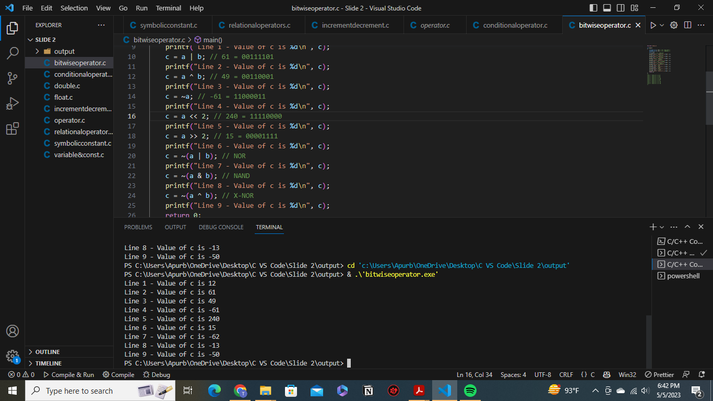

<!--Markdown Tutorial-->

Tanvir Anjum</br>
This is Second line

---

<!--Horizontal rule-->

# Tanvir Anjum

## Tanvir Anjum

### Tanvir Anjum

#### Tanvir Anjum

##### Tanvir Anjum

###### Tanvir Anjum

<br>

## Paragraph

<p>This is Tanvir Anjum Apurbo. You can compile and run this program to solve the given problem. It reads the number of test cases, followed by the test case descriptions. For each test case, it calculates the luckiness of each number in the given range and finds the luckiest number. Finally, it prints the luckiest number for each test case.<p>

<br>

<i>This is italic</i>  
_This is italic_

</br>

**This is bold text**

<br>

<del>This is strike</del>  
~~This is strike~~

<br>

`This is inline code`

```C
#include <stdio.h>

int fibonacciSum(int n);

int main()
{
    int sum = fibonacciSum(7);
    printf("Sum of the first 7 Fibonacci numbers: %d\n", sum);
    return 0;
}

int fibonacciSum(int n)
{
    int sum = 0;
    int a = 0, b = 1, fib = 0;

    for (int i = 1; i <= n; i++)
    {
        sum += a;
        fib = a + b;
        a = b;
        b = fib;
    }

    return sum;
}


```

<br>

## Orderd List

<ol>
<li>Apple</li>
<li>Orange</li>
<li>Banana</li>
</ol>

1. Apple
   1. 1Orange
2. Banana

<br>

## Unorderd List

- Apple
  - Mango
- Orange
- Banana

<br>

## Task List

- [x] Done
- [x] Done
- [] Not DOne

<br>

## Automatic Link

https://learnoopia.wixsite.com/learnopia

## Disable Link

`https://learnoopia.wixsite.com/learnopia`

## Markdown Link Syntax

[My Website: LearnOpia](https://learnoopia.wixsite.com/learnopia)  
[Facebook]  
[My Website: LearnOpia]

<br>

## Image Syntax

<br>

  


<br>
🥳  
<br>

## Table Syntax

| Name         | Email                    | ID          |
| ------------ | ------------------------ | ----------- |
| Tanvir Anjum | anjumtanvir667@gmail.com | 34893483048 |
| Tanvir Anjum | anjumtanvir667@gmail.com | 34893483048 |
| Tanvir Anjum | anjumtanvir667@gmail.com | 34893483048 |
| Tanvir Anjum | anjumtanvir667@gmail.com | 34893483048 |
| Tanvir Anjum | anjumtanvir667@gmail.com | 34893483048 |

<br/>

<!--Al link is here-->

[My Website: LearnOpia]: https://learnoopia.wixsite.com/learnopia
[Facebook]: https://www.facebook.com/tanviranjum.ap/
